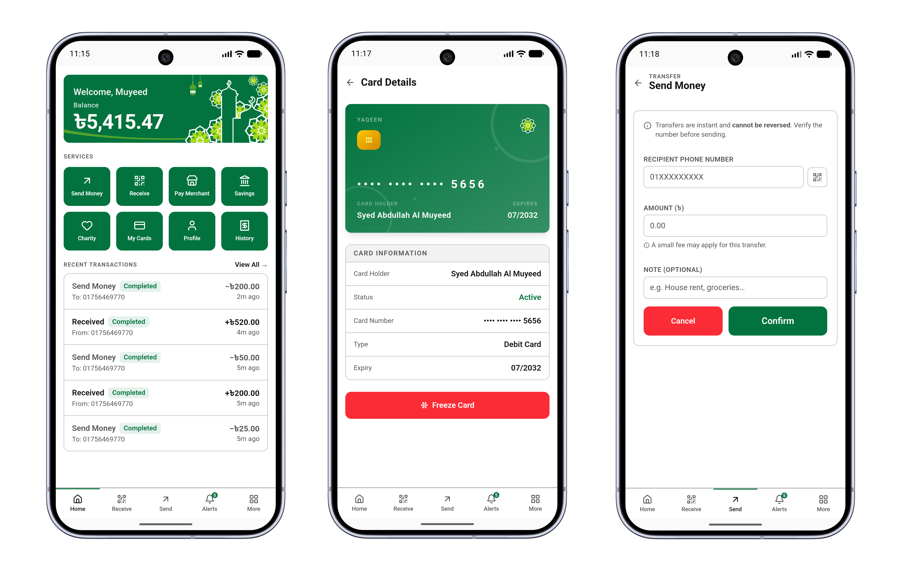
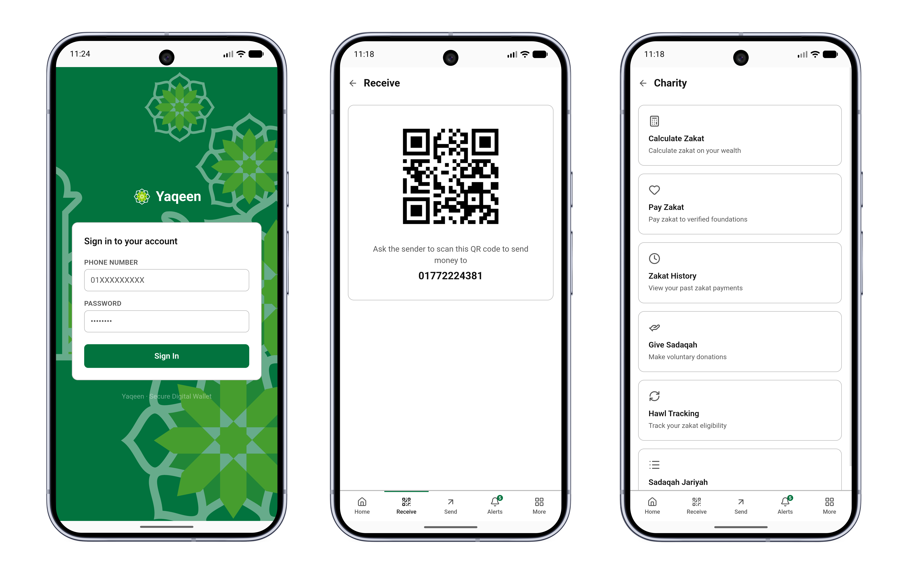

# Yaqeen

Sharia-compliant Islamic digital wallet. Android native app.

## Screenshots




## Overview

Yaqeen provides a halal financial ecosystem: a Django REST backend powers the API, a Next.js frontend delivers the web experience, and this Android app wraps it in a native container via WebView.

## How It Works

1. First launch displays a URL input screen where the user enters the Next.js frontend address.
2. URL is persisted locally in `yaqeen.properties`; subsequent launches go straight to the WebView.
3. Fullscreen WebView loads the Next.js app with JavaScript, DOM storage, camera, geolocation, and file upload support.
4. Native back navigation navigates WebView history via hardware back button.

## Tech Stack

| Layer      | Technology                                   |
| ---------- | -------------------------------------------- |
| Language   | Kotlin 2.2                                   |
| UI         | Jetpack Compose, Material 3, Android WebView |
| Build      | Gradle 9.4, Kotlin DSL                       |
| Target SDK | 36 (extension level 1)                       |
| Min SDK    | 24 (Android 7.0)                             |

## Prerequisites

- Android Studio (latest stable)
- JDK 17+
- Android SDK with API 36

## Setup

```bash
# Build from CLI
cd Yaqeen && ./gradlew assembleDebug
```

The default URL is configured in `Yaqeen/app/src/main/assets/yaqeen.properties`.

## Usage

### First launch

Enter the URL of your Next.js frontend (e.g. `https://api.example.com/login`) on the input screen and tap Connect. The URL is saved to `yaqeen.properties` in the app's internal storage.

### Pre-configure the URL

To ship the app with a pre-configured URL, edit the bundled properties file before building:

```
# Yaqeen/app/src/main/assets/yaqeen.properties
url=https://your-domain.com/login
```

### Reset the URL

To return to the input screen, clear the app's storage from Android Settings or reinstall the app.

## Permissions

The app requests the following to support full web functionality:

- Internet / Network State
- Camera
- Microphone
- Location (fine and coarse)
- Media / File access

## License

MIT (c) 2026 Syed Abdullah Al Muyeed
